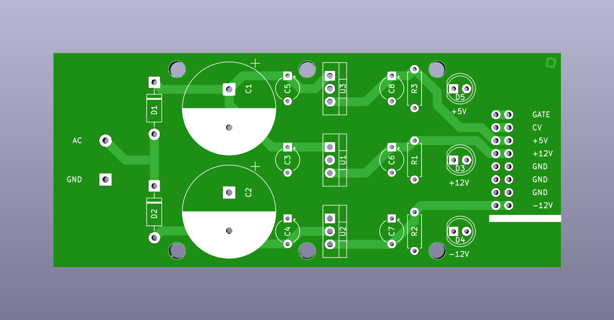
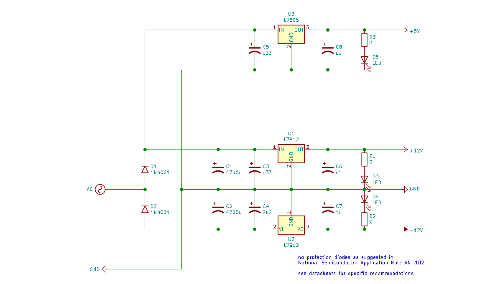

# Basic Eurorack Power Supply

This power supply derives +12 V, -12 V and +5 V from 12 V AC. It is intended as a cheap and simple bipolar (plus 5 V) power supply for modular synthesizers and general test setups.

The double-sided PCB layout is very straightforward. One of the AC inputs connected on the left will be referenced as GND. The regulated DC output on the right will be relative to this reference.

To keep it as simple as possible the circuit only contains essential components. 7812, 7912 and 7805 linear regulators are used in their basic fixed-voltage configuration (as suggested in the datasheets and used in many designs e.g. from [MFOS](http://musicfromouterspace.com/analogsynth_new/WALLWARTSUPPLY/WALLWARTSUPPLY.php) and [ModularSynth.ru](http://www.modularsynth.ru/en/diy/low_cost_psu/)).

The diodes, voltage regulators and the AC supply used determine the amount of current this power supply can provide. Depending on the application additional fuses or protection diodes are recommended. If heatsinks are used on the linear regulators, they must not touch each other.

Components listed on the BOM are only loosely defined. They have to be specified/adapted to fit individual requirements (with preferably generous safety margins, e.g. capacitors rated 35 V for 12-15 V AC input).

Dimensions: 99.06 x 41.91 mm

Mounting hole pattern: 50.8 (25.4) x 35.56 mm (~3 mm hole diameter)

The PCB files are licensed under a [Creative Commons Attribution-NonCommercial-ShareAlike 4.0 International License](https://creativecommons.org/licenses/by-nc-sa/4.0/).
